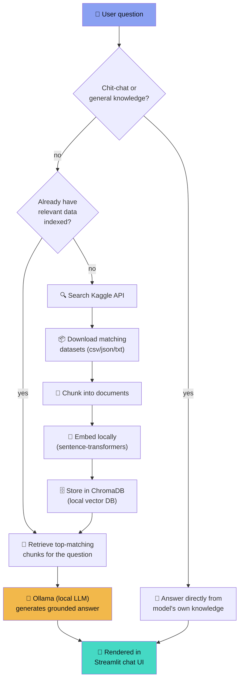

<div align="center">

# 🧠 Assistly

**A local AI assistant that turns Kaggle into your personal, private data analyst.**

Ask a question → it searches Kaggle for relevant datasets → indexes them into a local vector database → a local LLM answers using that data as grounding. Nothing ever leaves your machine.

[](https://www.python.org/)
[](https://streamlit.io/)
[](https://ollama.com/)
[](https://www.trychroma.com/)
[](https://www.kaggle.com/docs/api)
[](LICENSE)
[](#contributing)

</div>

---

## 📸 Screenshots

> Replace these with real screenshots before publishing — save them under `docs/screenshots/` and update the paths below.

| Home / Empty State | Live Pipeline in Action |
|---|---|
| 
 | 
 |

## 🎬 Demo


---

## ✨ Features

- 🔍 **Automatic dataset discovery** — searches Kaggle for datasets relevant to your question, no manual downloading
- 🧠 **Fully local LLM** — answers generated by a model running on your machine via [Ollama](https://ollama.com/), no OpenAI/Anthropic API key needed
- 📦 **Local vector search** — [ChromaDB](https://www.trychroma.com/) + [sentence-transformers](https://www.sbert.net/) embeddings, all on-disk, nothing sent to the cloud
- 💬 **Conversational memory** — follow-up questions ("what about the highest one?") are understood in context of the previous question
- 🗨️ **Smart chit-chat detection** — casual messages ("thanks", "hi") get a normal reply instead of being forced through the whole data pipeline
- 📚 **General knowledge fallback** — definition/explanation questions ("what is DDR5 RAM?") are answered from the model's own knowledge when the indexed data isn't relevant
- ⚡ **Skips redundant searches** — reuses already-indexed data for related follow-ups instead of re-querying Kaggle every time
- 🎛️ **Live pipeline visualization** — watch each stage (search → fetch → index → retrieve → generate) light up in real time instead of staring at a spinner
- 🎨 **Polished dark UI** — animated, glassy, built entirely with custom CSS on top of Streamlit
- 💾 **Persistent & resumable** — indexed datasets and embeddings are cached to disk in `data/`, so re-running the app doesn't re-download or re-embed everything

---

## 🏗️ Architecture



**Design principle:** the whole point of local RAG is trust — so the UI shows the pipeline live rather than hiding it behind a spinner. You always know whether an answer came from real Kaggle data or the model's own knowledge.

---

## 🚀 Installation

### 1. Prerequisites

- **Python 3.9+**
- **[Ollama](https://ollama.com/download)** — the local LLM runtime

```bash
ollama pull llama3.1
```
(Lower-resource alternative: `ollama pull llama3.2:1b`)

### 2. Get a Kaggle API token

1. Go to [kaggle.com/settings](https://www.kaggle.com/settings) → **API** → **Create New Token**
2. Save the downloaded `kaggle.json` to:
   - macOS/Linux: `~/.kaggle/kaggle.json`
   - Windows: `C:\Users\<you>\.kaggle\kaggle.json`
3. (macOS/Linux) Lock down permissions:
   ```bash
   chmod 600 ~/.kaggle/kaggle.json
   ```

### 3. Clone and set up the project

```bash
git clone https://github.com/<your-username>/assistly.git
cd assistly
python3 -m venv venv
source venv/bin/activate        # Windows: venv\Scripts\activate
pip install -r requirements.txt
```

---

## ▶️ Usage

```bash
streamlit run app.py
```

This opens Assistly at `http://localhost:8501`.

- Type a question, e.g. *"What factors affect house prices in California?"*
- Watch the pipeline rail search Kaggle, download, index, retrieve, and generate — live
- Ask follow-ups naturally (*"what about the most expensive one?"*) — context carries over
- Check the sidebar for which datasets are currently indexed
- Use **Reset vector database** to wipe everything and start clean

**Tip:** keyword-style queries work better than full sentences for the Kaggle search step — `"California housing prices"` finds a better dataset than `"What factors affect house prices in California?"`.

---

## 🛠️ Tech Stack

| Layer | Technology | Purpose |
|---|---|---|
| UI | [Streamlit](https://streamlit.io/) + custom CSS | Chat interface, live pipeline visualization |
| LLM | [Ollama](https://ollama.com/) (e.g. Llama 3.1) | Local answer generation — no cloud API |
| Embeddings | [sentence-transformers](https://www.sbert.net/) (`all-MiniLM-L6-v2`) | Turns text into vectors, runs locally |
| Vector store | [ChromaDB](https://www.trychroma.com/) | Local, persistent similarity search |
| Data source | [Kaggle API](https://www.kaggle.com/docs/api) | Discovers and downloads relevant datasets |
| Data handling | [pandas](https://pandas.pydata.org/) | Parses and chunks CSV/tabular data |

---

## 📁 Folder Structure

```
assistly/
├── app.py                # Streamlit entry point — UI flow, chat loop, pipeline orchestration
├── ui.py                 # All CSS/HTML rendering — theme, animations, pipeline rail, cards
├── rag_engine.py          # Core orchestrator — decides search/retrieve/generate, chit-chat detection
├── kaggle_client.py       # Kaggle API wrapper — search & download datasets
├── document_loader.py     # Turns raw dataset files into embeddable text chunks
├── vector_store.py        # ChromaDB wrapper — embedding, storage, similarity search
├── llm_ollama.py          # Ollama wrapper — prompt construction, local LLM calls
├── requirements.txt       # Python dependencies
├── README.md              # You are here
└── data/                  # Created at runtime — cached datasets + vector DB (gitignored)
    ├── kaggle_downloads/
    └── chroma_db/
```

### What each file actually does

<details>
<summary><code>app.py</code> — the Streamlit application</summary>

The entry point. Sets up page config, injects the theme from `ui.py`, manages `st.session_state` (chat history, indexed datasets, the `RAGEngine` instance), renders the sidebar control panel, and drives the main loop: take a question → route it through `RAGEngine` → render the pipeline rail live as each stage completes → display the final answer.
</details>

<details>
<summary><code>ui.py</code> — theme and rendering</summary>

No business logic — purely presentational. Exposes functions like `inject_css()`, `render_header()`, `render_pipeline()`, `render_sources()` that return HTML/CSS strings for `app.py` to pass to `st.markdown(..., unsafe_allow_html=True)`. Deliberately avoids `backdrop-filter` (GPU-blur effects that can silently fail to render on some systems) in favor of well-supported `transform`/`opacity`/`background-position` animations.
</details>

<details>
<summary><code>rag_engine.py</code> — the orchestrator</summary>

The `RAGEngine` class ties everything together:
- `is_chitchat()` — detects casual remarks that shouldn't trigger a data search
- `build_retrieval_query()` — folds the previous question into follow-ups so vague questions like "what about the highest one?" still retrieve the right context
- `has_local_context()` — checks if already-indexed data is a good enough match before firing off a new Kaggle search
- `find_and_index_datasets()` — searches Kaggle, downloads, chunks, and embeds new datasets
- `ask()` — retrieves relevant chunks and asks the LLM to answer
</details>

<details>
<summary><code>kaggle_client.py</code> — Kaggle API integration</summary>

Thin wrapper around the official `kaggle` Python package. `search_datasets()` finds datasets by keyword (sorted by votes); `download_dataset()` downloads and unzips one, with a size cap (`MAX_DATASET_SIZE_MB`, default 100MB) so a single dataset can't blow up your disk.
</details>

<details>
<summary><code>document_loader.py</code> — file → text chunks</summary>

Converts downloaded dataset files into embeddable text. Tabular files (`.csv`/`.tsv`) get a schema-description chunk plus row-group chunks (~20 rows each); text files (`.txt`/`.md`/`.json`) get sliding-window chunks with overlap. Row sampling is capped (`MAX_ROWS_SAMPLED`, default 500) to keep indexing fast.
</details>

<details>
<summary><code>vector_store.py</code> — local vector database</summary>

Wraps ChromaDB with a `PersistentClient` (data survives restarts) and a `SentenceTransformerEmbeddingFunction` (`all-MiniLM-L6-v2`, runs entirely on CPU/local GPU — no API calls). Exposes `add_documents()`, `query()` (returns matches + distances), and `reset()`.
</details>

<details>
<summary><code>llm_ollama.py</code> — local LLM calls</summary>

Builds prompts and calls the local Ollama server via the `ollama` Python package. Two system prompts: one for data-grounded answers (uses retrieved context, but can fall back to general knowledge for definition-style questions) and one for chit-chat (skips context entirely).
</details>

---

## 🗺️ Future Improvements

- [ ] Support Excel (`.xlsx`) and Parquet dataset files
- [ ] Let users manually upload/pin their own datasets instead of only Kaggle search
- [ ] Show retrieval confidence scores next to source citations
- [ ] Add a "regenerate answer" button
- [ ] Multi-turn dataset comparison ("compare this to the EV dataset from earlier")
- [ ] Export chat + sources as a shareable report
- [ ] Optional support for other local LLM runtimes (LM Studio, vLLM)
- [ ] Dockerfile for one-command setup

---

## 🤝 Contributing

Contributions are welcome!

1. Fork the repo
2. Create a branch: `git checkout -b feature/my-feature`
3. Make your changes and commit: `git commit -m "Add my feature"`
4. Push: `git push origin feature/my-feature`
5. Open a Pull Request

Please keep PRs focused — one feature or fix per PR is easier to review.

---

## 📄 License

This project is licensed under the [MIT License](LICENSE).

---


